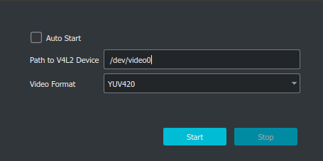

# obs-v4l2sink

An [OBS Studio][obs-proj] plugin that provides output capabilities to a
Video4Linux2 device. It is basically a Linux version of [obs-virtual-cam][vcam],
but only contains the video sink part. You can use it with
[v4l2loopback][v4l2loopback] to achieve cross-program video transfer between OBS
Studio and third party software supporting Video4Linux2, e.g. to present an OBS
session in proprietary browser-based conferencing systems by selecting the OBS
session as a webcam.

The idea for this plugin originated from the discussions around [obs-virtual-cam
issue #17][vcam#17].

[obs-proj]: https://obsproject.com/
[vcam]: https://github.com/CatxFish/obs-virtual-cam
[v4l2loopback]: https://github.com/umlaeute/v4l2loopback
[vcam#17]: https://github.com/CatxFish/obs-virtual-cam/issues/17

## Usage with v4l2loopback

- Make sure to [load the v4l2loopback module][run-v4l2loopback] and check the Device Path.
  - If using Chrome or Chromium you must use the option `exclusive_caps=1`.
- Open OBS and select the menu entry `Tools > V4L2 Video Output`.
- Fill in the Device Path and select the appropriate video format.
- Click the `Start` button.



[run-v4l2loopback]: https://github.com/umlaeute/v4l2loopback#run

## Build [Debian]

- Install QT

```
sudo apt install qtbase5-dev
```

- Get obs-studio source code

```
git clone --recursive https://github.com/obsproject/obs-studio.git
```

- Build plugins

```
git clone https://github.com/CatxFish/obs-v4l2sink.git
cd obs-v4l2sink
mkdir build && cd build
cmake -DLIBOBS_INCLUDE_DIR="../../obs-studio/libobs" -DCMAKE_INSTALL_PREFIX=/usr ..
make -j4
sudo make install
```

## Build [RHEL/CentOS]

#### Dependencies

If you are compiling this on Fedora, I would suggest installing the following dependencies inside a `toolbox` ([here](https://fedoramagazine.org/a-quick-introduction-to-toolbox-on-fedora/) you can learn more about it)

- `Development Tools` group (install with `sudo yum groupinstall "Development Tools"`)
    - `make`
    - `cmake`
    - `gcc`
- `qt5-qtbase-devel`
- RPM Fusion Free ([here](https://rpmfusion.org/Configuration) you can learn how to enable this repository)
    - `obs-studio-libs`
    - `obs-studio-devel`


#### Build

Download sources and prepare the build files

```bash
git clone --recursive https://github.com/obsproject/obs-studio.git
git clone https://github.com/CatxFish/obs-v4l2sink.git
cd obs-v4l2sink
mkdir build && cd build
```

Compile and install the plugin

```bash
cmake -DLIBOBS_INCLUDE_DIR="../../obs-studio/libobs" -DCMAKE_INSTALL_PREFIX=/usr -DLIBOBS_LIB="/usr/lib64/libobs.so.0" -DCMAKE_INSTALL_PREFIX="${HOME}/.config/obs-studio/plugins/v4l2sink" ..
make -j4
make install
```

The plugin will be installed inside `~/.config/obs-studio/plugins`

#### Flatpak OBS

If you are using the Flatpak OBS version, copy the plugin's files into the application folder:

```bash
sudo cp -r $HOME/.config/obs-studio/plugins/v4l2sink/* /var/lib/flatpak/app/com.obsproject.Studio/x86_64/stable/active/files/
```

Open OBS and navigate to the "Tools" drop-down: you should now see the V4L2 video output
